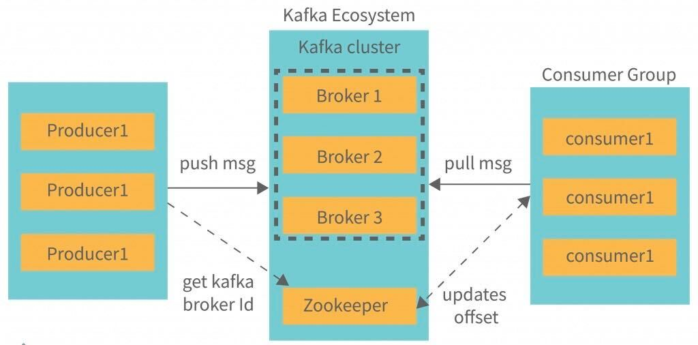

# Stock Market Kafka Real Time Data Engineering Project

## Introduction 
In this project, you will execute an End-To-End Data Engineering Project on Real-Time Stock Market Data using Kafka.
We are going to use different technologies such as Python, Amazon Web Services (AWS), Apache Kafka, Glue, Athena, and SQL.

We will be rendering stock market data from csv file (data/stock_data.csv) as it contains lots of data and we are mainly interested to understand about kafka end-to-end use cases here.

**Note:** apache-kafka should be installed and running before performing this project (either of cloud or on local).

## Architecture 

## Technology Used
- Programming Language - Python
- Amazon Web Service (AWS)

1. **S3 (Simple Storage Service)**
2. **Athena**: it will read the S3 source data from json file (for this project), and we can read the data using sql queries here.
3. **Glue Crawler**: it will fetch the data from S3 as source and create table definitions and pass to the "Glue Catalog".
4. **Glue Catalog**: it is the kind of persitent storage of any glue metadata.
5. **EC2 / Local**: Apache Kafka should be installed here.

## Dataset Used
You can use any dataset, we are mainly interested in operation side of Data Engineering (building data pipeline)

## PRACTICAL ##

**Install Required python packages for this project kafka-python:**

    pip3 install kafka-python       # for kafka
    pip3 install s3fs               # for AWS S3

**GLUE IAM ROLE to access S3:**
                            

a)  select policy called "AWSGlueServiceRole" (aws managed policy)

b)  create another policy for accessing S3 bucket as below:
    
    {
        "Version": "2012-10-17",
        "Statement": [
            {
                "Effect": "Allow",
                "Action": [
                    "s3:GetObject",
                    "s3:PutObject"
                ],
                "Resource": [
                    "arn:aws:s3:::kafka-s3-shiva/*"
                ]
            }
        ]
    }

c)  Trust relationships as "glue.amazonaws.com" service as below:

    {
        "Version": "2012-10-17",
        "Statement": [
            {
                "Effect": "Allow",
                "Principal": {
                    "Service": "glue.amazonaws.com"
                },
                "Action": "sts:AssumeRole"
            }
        ]
    }

**ON AWS glue side:**
                    

1) While creating AWS glue crawler (under glue catalog in AWS)
    a) select relevent S3 bucket and put the slash (/) in the end of S3, so that crawler can read all the objects from the S3, eg:
        s3://kafka-s3-shiva/

2)  If "Athena" gives any issue while quering the data from S3, make sure you have a temporary "S3 bucket" for crawler to save its queried data
    go to "Athena" --> "Setting" --> Select temporary backup S3 bucket     

